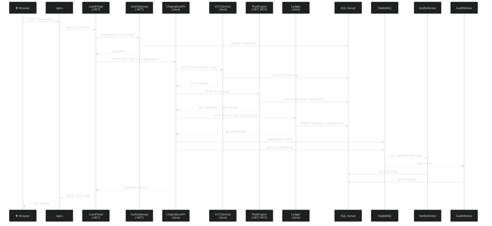
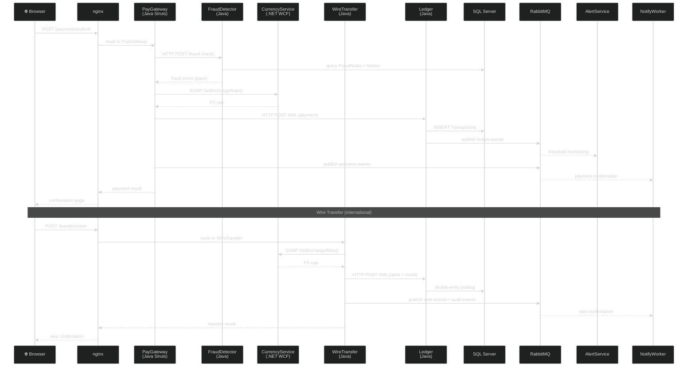

# Data Flow — Zava Bank

Two key business flows: a loan application lifecycle and a payment/wire transfer flow. These show how requests traverse the .NET and Java workstreams end-to-end.

## Loan Application Flow

## Payment and Wire Transfer Flow

