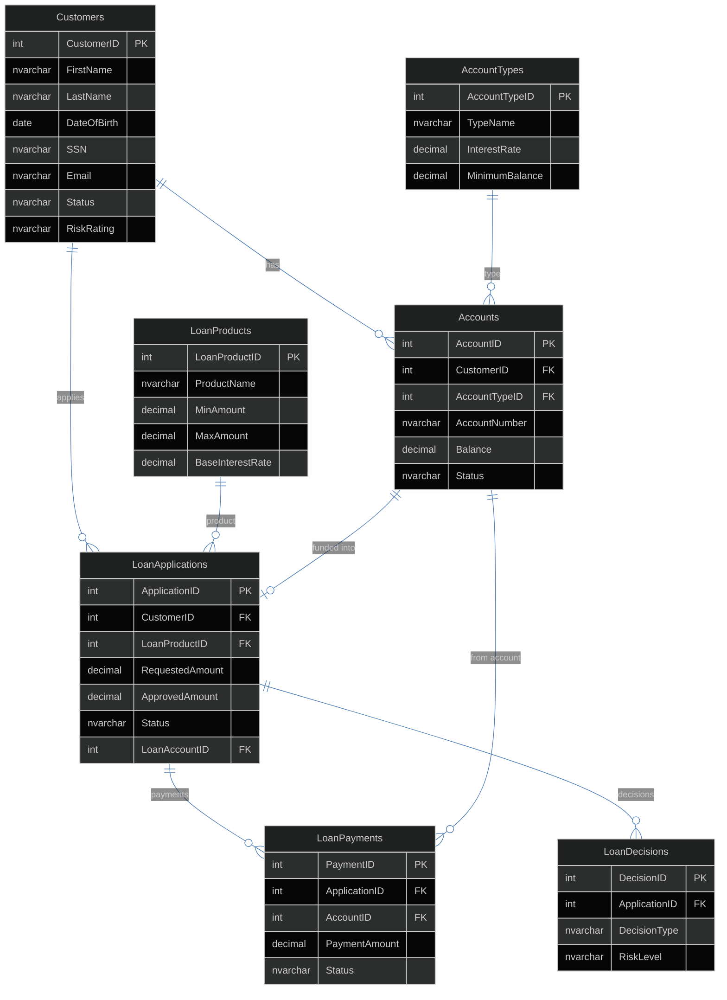
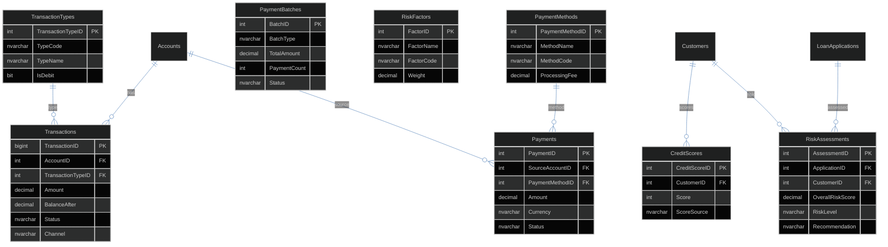
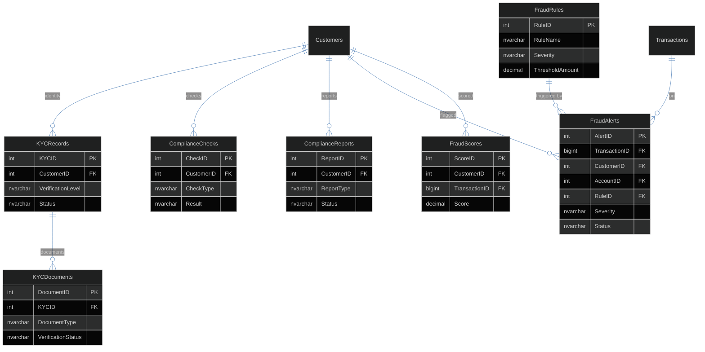
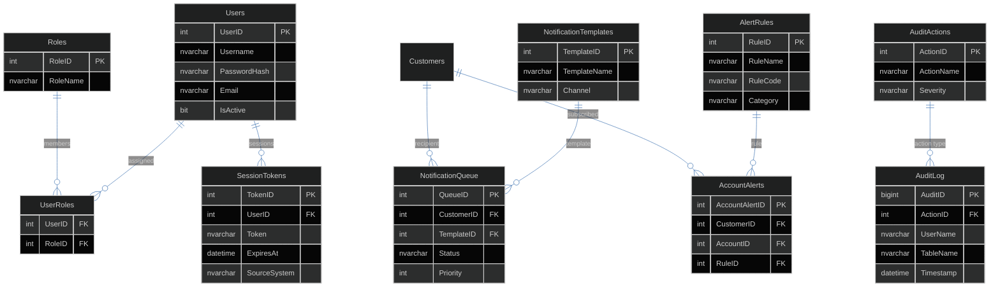

# Database Schema — Zava Bank (ZavaBankDB)

Entity-relationship diagram of the shared SQL Server database. All 23 application nodes connect to this single instance. Tables are organized into 14 domain groups, all in the `dbo` schema.

## Core Banking and Loans

## Transactions, Payments, and Risk

## KYC, Fraud, and Compliance

## Auth, Notifications, Alerts, and Audit

