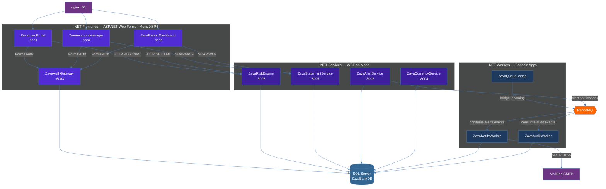

# .NET Workstream — Zava Bank

All 11 .NET Framework 4.8 nodes: 4 ASP.NET Web Forms frontends, 4 WCF SOAP services, and 3 background console-app workers. Shows synchronous calls (SOAP/HTTP) and async messaging through RabbitMQ.

