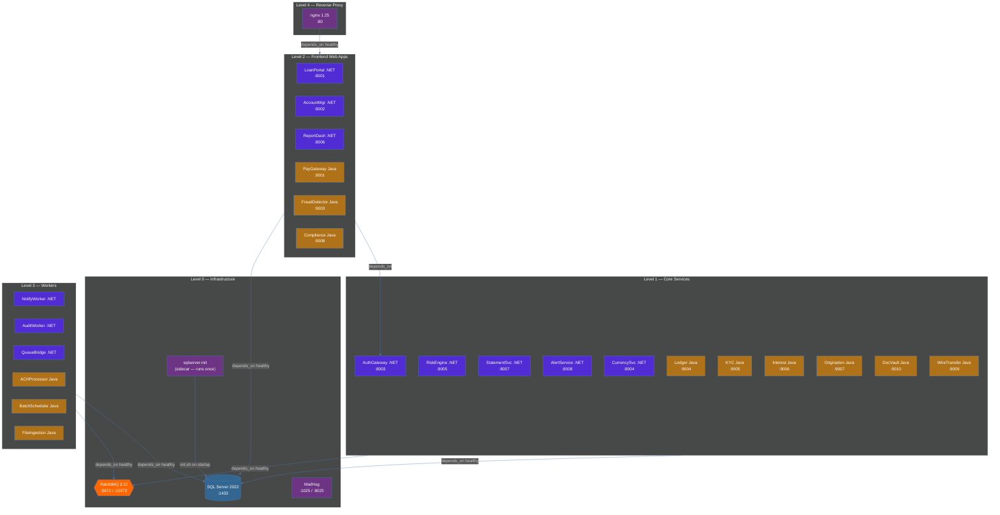
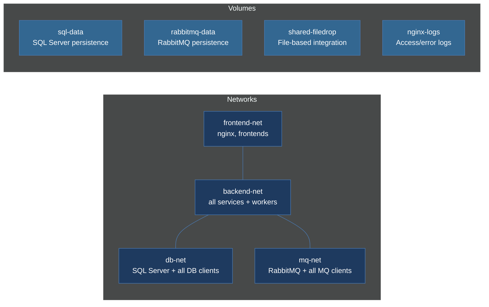

# Infrastructure — Zava Bank Docker Compose

The Docker Compose topology showing 28 containers across 4 networks, 3 volumes, and the dependency layers from infrastructure up through workers.

## Network Topology

