# Java Workstream — Zava Bank

All 12 Java nodes: 3 Struts/JSP frontends, 6 servlet-based API services, and 3 background workers (plus QueueBridge which is .NET but bridges to Java). Shows HTTP/XML synchronous calls and RabbitMQ async messaging.

```mermaid
---
config:
  theme: dark
  themeVariables:
    primaryColor: "#b07219"
    primaryTextColor: "#ffffff"
    lineColor: "#4a7bb5"
    secondaryColor: "#8a5a14"
    tertiaryColor: "#6b4410"
---
flowchart TB
    classDef java fill:#b07219,stroke:#4a7bb5,color:#ffffff
    classDef servlet fill:#8a5a14,stroke:#4a7bb5,color:#ffffff
    classDef worker fill:#1e3a5f,stroke:#4a7bb5,color:#ffffff
    classDef database fill:#336791,stroke:#4a7bb5,color:#ffffff
    classDef messaging fill:#ff6600,stroke:#4a7bb5,color:#ffffff
    classDef infra fill:#6c3483,stroke:#4a7bb5,color:#ffffff
    classDef wcf fill:#512bd4,stroke:#4a7bb5,color:#ffffff

    Nginx["nginx :80"]:::infra

    subgraph FE["Java Frontends — Struts / JSP on Tomcat"]
        PG["ZavaPayGateway\n:9001 (Struts 1.x)"]:::java
        FD["ZavaFraudDetector\n:9003 (Struts 2.x)"]:::java
        CR["ZavaComplianceReporter\n:9008 (JSP/Servlet)"]:::java
    end

    subgraph SVC["Java Services — Servlets on Tomcat"]
        LED["ZavaLedger\n:9004 (Java 17)"]:::servlet
        KYC["ZavaKYCService\n:9005"]:::servlet
        INT["ZavaInterestCalc\n:9006"]:::servlet
        ORI["ZavaOriginationAPI\n:9007"]:::servlet
        DOC["ZavaDocVault\n:9010"]:::servlet
        WTS["ZavaWireTransfer\n:9009"]:::servlet
    end

    subgraph WK["Java Workers — Console Apps"]
        ACH["ZavaACHProcessor"]:::worker
        BS["ZavaBatchScheduler"]:::worker
        FI["ZavaFileIngestion"]:::worker
    end

    SQL[("SQL Server\nZavaBankDB")]:::database
    RMQ{{"RabbitMQ"}}:::messaging
    CS["ZavaCurrencyService\n(.NET WCF)"]:::wcf
    FileDrop["Shared FileDrop"]:::infra

    Nginx --> PG & FD & CR
    PG -->|"HTTP POST XML"| LED
    PG -->|"SOAP/WCF"| CS
    PG -->|"fraud check"| FD
    FD -->|"HTTP GET XML"| LED
    FD -->|"HTTP GET"| KYC
    CR -->|"HTTP GET XML"| LED
    CR -->|"HTTP GET"| KYC
    ORI -->|"HTTP POST XML"| LED
    ORI -->|"HTTP POST"| KYC
    ORI -->|"SOAP/WCF risk score"| CS
    WTS -->|"HTTP POST XML"| LED
    WTS -->|"SOAP/WCF FX rate"| CS
    WTS -->|"HTTP GET KYC"| KYC

    PG -->|"payment.events"| RMQ
    WTS -->|"wire.events"| RMQ
    FD -->|"fraud.alerts"| RMQ
    ORI -->|"loan.events"| RMQ
    ACH -->|"ach.results"| RMQ
    LED -->|"ledger.events"| RMQ

    BS -->|"HTTP POST"| INT
    BS -->|"HTTP POST"| LED

    ACH -.->|"read NACHA files"| FileDrop
    FI -.->|"read CSV/DAT files"| FileDrop

    LED & KYC & INT & ORI & DOC & WTS --> SQL
    ACH & BS & FI --> SQL
```

