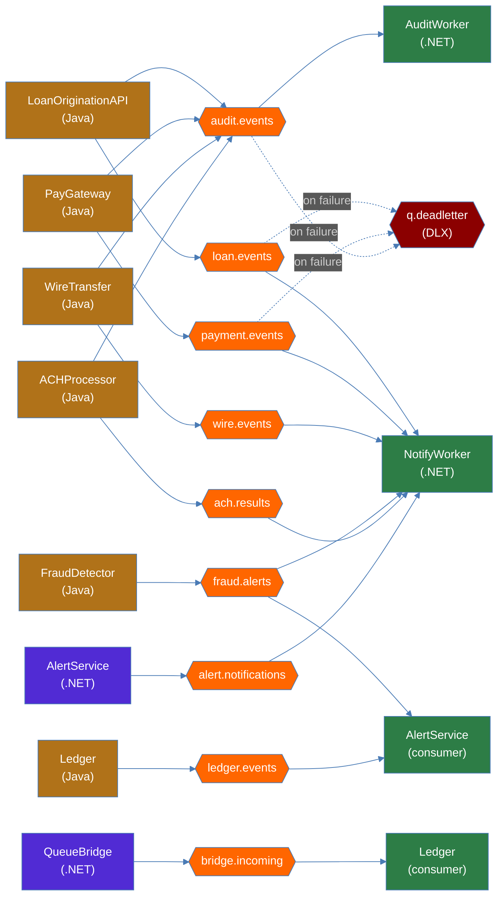

# Messaging Flow — Zava Bank RabbitMQ Topology

All asynchronous messaging routes through RabbitMQ (/zavabank vhost). Services publish domain events to topic queues; workers consume them. All queues are bound to the `zava.dlx` dead-letter exchange for failed message handling.

## Publishers and Consumers

## Message Flow Summary

| Queue | Publishers | Consumers | Content |
|-------|-----------|-----------|---------|
| `loan.events` | LoanOriginationAPI | NotifyWorker | Loan approval/denial notifications |
| `payment.events` | PayGateway | NotifyWorker | Payment confirmations |
| `wire.events` | WireTransfer | NotifyWorker | Wire transfer confirmations |
| `fraud.alerts` | FraudDetector | NotifyWorker, AlertService | Fraud alert notifications |
| `audit.events` | OriginationAPI, PayGateway, WireTransfer, ACHProcessor | AuditWorker | Immutable audit trail records |
| `ach.results` | ACHProcessor | NotifyWorker | ACH batch processing results |
| `ledger.events` | Ledger | AlertService | Transaction threshold monitoring |
| `alert.notifications` | AlertService | NotifyWorker | Triggered alert delivery |
| `bridge.incoming` | QueueBridge | Ledger | Re-published file-drop messages |
