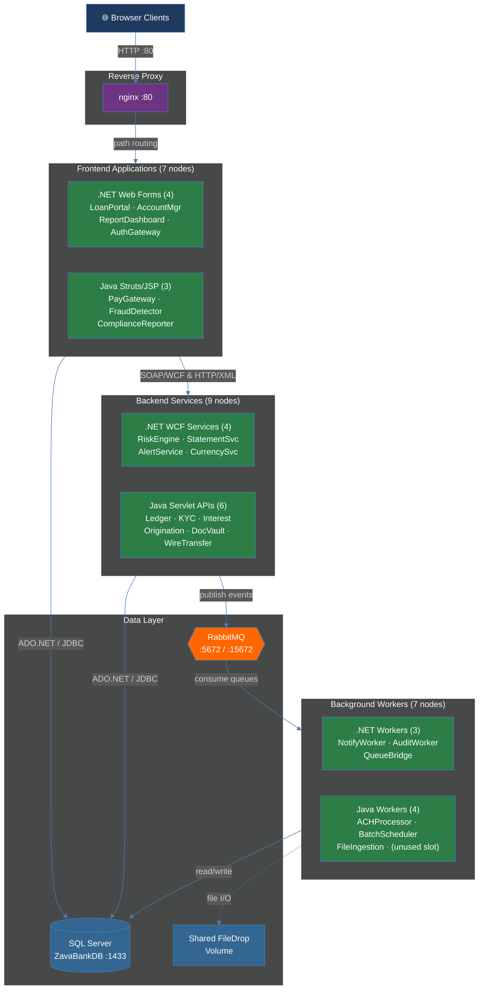

# System Overview — Zava Bank

The 30,000-foot view of Zava Bank's legacy banking platform. All external traffic enters through nginx on port 80 and is routed to 7 frontend applications, which call backend services backed by a shared SQL Server database and RabbitMQ message broker.

